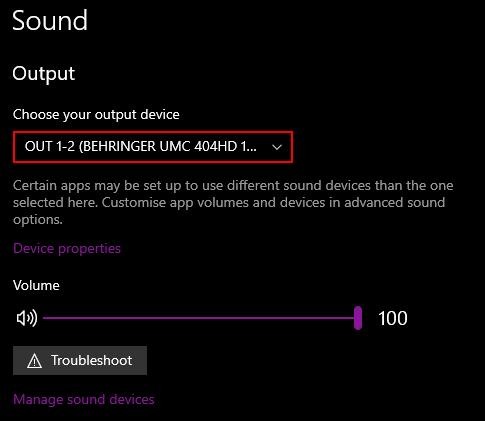

# Ncmpcpp on Windows

1. [MPD](#mpd)
2. [ncmpcpp](#ncmpcpp)

## Setting up MPD <a name="mpd"></a>
1. Install [Chocolatey](https://chocolatey.org/install)
2. Open a terminal and run: `choco install mpd`
3. Create a folder called `mpd`. I used `C:/mpd` as my directory. Remember to replace all occurrences of my directory with your own.
4. Create a folder inside `mpd` called `playlists`.
5. Create a file called `mpd.conf` and open it.
6. Copy the contents inside
    ```
    bind_to_address "your_ip_adress"
    port "6600"

    music_directory "C:/replace_with_my_music_directory"
    log_file "C:/mpd/mpd.log"
    db_file "C:/mpd/mpd.db"
    playlist_directory "C:/mpd/playlists"
    state_file "C:/mpd/mpdstate"
    pid_file "C:/mpd/mpd.pid"

    audio_output {
        type "winmm"
        name "replace_with_any_name"
        mixer_type "software"
        device "replace_with_device_name"
    }
    ```
    Replace all `directories` with your own.

    Edit `bind_to_address` to your **local ip** eg. `"192.168.0.123"`. Don't use **127.0.0.1**!

    Edit `name` to anything your want.

    Edit `device` name with one of these two ways:

    1. In the windows 10 sound settings. Under `Output - Choose your output device`. Copy the text circled in red to `device`.
   
        

    2. Press Win+R. Type dxdiag. Click the **sound** tab and copy the device name into `device`.
7. In terminal run `cd C:\mpd`.
8. Then run MPD with: `mpd mpd.conf`
9. MPD is now running. You'll get a couple of errors; ignore these.
10. Your folder structure should look like this:
    ```
    mpd
    ├── mpd.conf
    ├── mpd.db
    ├── mpd.log
    ├── mpdstate
    │
    └───playlists
    ```


11. To automatically run mpd at boot, first:

    [Download the latest release.](https://github.com/SeidChr/RunHiddenConsole/releases/) This will allow us to run mpd without a window.

    Then copy it to `C:\ProgramData\chocolatey\bin` and rename it to `mpdw.exe`

    Then run this command:

    ```
    reg add HKEY_CURRENT_USER\SOFTWARE\Microsoft\Windows\CurrentVersion\Run /v mpd /t REG_SZ /d "C:\ProgramData\chocolatey\bin\mpdw.exe C:\mpd\mpd.conf"
    ```

## Setting up ncmpcpp <a name="ncmpcpp"></a>

1. You cannot run ncmpcpp natively on windows so you'll need to use Windows Subsystem for Linux. [You can install it here.](https://docs.microsoft.com/en-us/windows/wsl/install-win10)

    I used Ubuntu for this example. 
2. `sudo apt install ncmpcpp`
3. `mkdir -p ~/.ncmpcpp/lyrics`
4. `nano ~/.ncmpcpp/config`
5. Open CMD or PowerShell and type `ipconfig`. Note your IPv4 Address.
6. Paste the following config. Make sure to change **mpd_host** to your IP. 
   
```
mpd_host = "LOCAL_IP_HERE"
mpd_port = 6600 
media_library_primary_tag = album_artist
```
7. Then type: `ncmpcpp`
8. Press `u` to update the music directory

Ncmpcpp should be working now; however it's quite ugly in it's default configuration. You can grab mine [here](config).

[If you want to learn the default shortcuts.](https://pkgbuild.com/~jelle/ncmpcpp/)

[If you want to change how the players looks or works.](https://github.com/ncmpcpp/ncmpcpp/blob/master/doc/config)

[If you would like to change keyboard shortcuts.](https://github.com/ncmpcpp/ncmpcpp/blob/master/doc/bindings)
